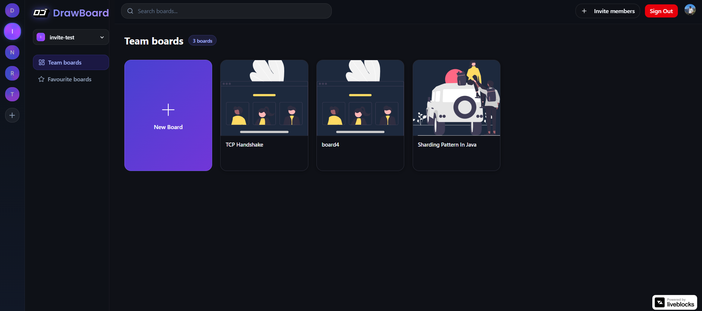
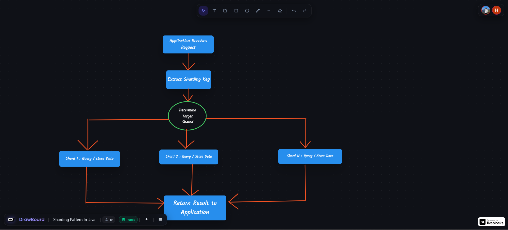
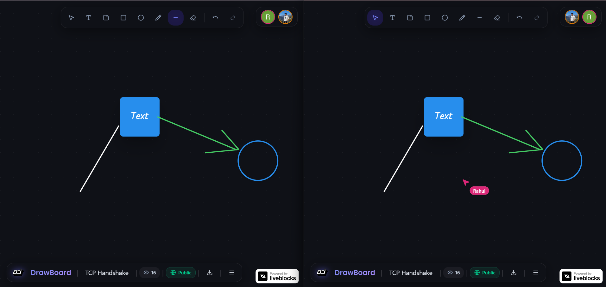
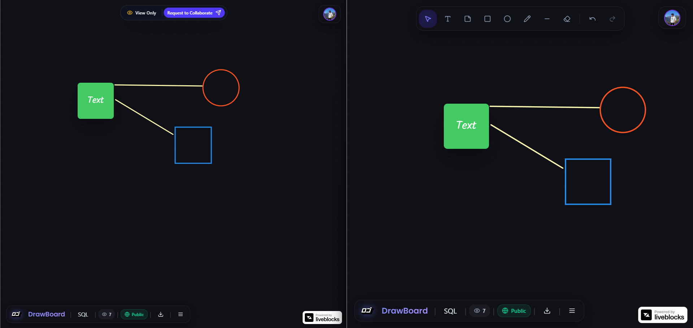
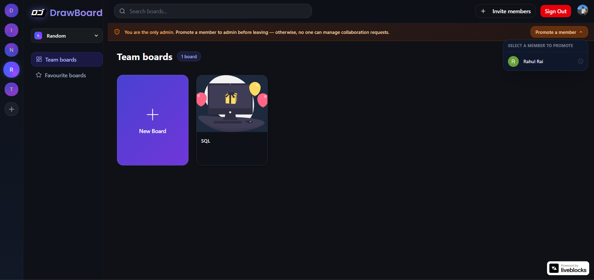

# DrawBoard

I built DrawBoard because I was fascinated by how collaborative tools like Figma and Miro handle real-time sync without descending into chaos when multiple people edit the same thing at once. Most open-source whiteboard clones either cheat by just polling a database (which is slow and clunky), or they require deploying a massive infrastructure of custom WebRTC signaling servers and Redis instances.

DrawBoard is my take on a production-ready, real-time collaborative whiteboard. Multiple users can jump into a board and draw simultaneously using shapes, freehand strokes, straight lines, sticky notes, and text. You see everyone's cursors moving live with sub-16ms latency. 

The entire canvas state is backed by a Conflict-free Replicated Data Type (CRDT) engine. If two people grab the exact same sticky note and drag it in opposite directions at the exact same millisecond, the system resolves the state deterministically instead of throwing a data-race error or corrupting the board.

## Visuals

Here is how the application looks in action:

**The Dashboard:**


**The Real-time Canvas:**


**Multiplayer Cursors in Action:**


**Handling Collaboration Requests:**


**Admin Protections:**


## Core Features

I tried to pack in as many "real" application features as possible rather than just stopping at a minimum viable product. 

For the canvas itself, you've got your standard rectangle, ellipse, and text tools, but I also wired up a pressure-sensitive freehand pen (using `perfect-freehand`), a straight line tool, and an eraser that actually hit-tests the objects around it by proximity instead of just acting like a white paintbrush. If you select or resize an object, it locks that object for you and shows a visual indicator to everyone else in the room so they know you're working on it. Undo/Redo is also built directly into the CRDT history log, which means it tracks changes perfectly across the network.

Outside the canvas, things are organized into multi-tenant "Organizations." A board belongs to a workspace org rather than a single user. I built a server-brokered access system where guests can request access to public boards, and organization admins receive instant toast notifications via a WebSocket push to approve or block them. The moment an admin approves a request, the user's JWT is reloaded client-side and their canvas unlocks instantly without them having to refresh the page.

## The Architecture (Two Databases, On Purpose)

The biggest architectural decision I made was splitting the data layer completely in half based on read/write patterns.

```
Next.js Client ──► Liveblocks Auth Route ──► Verify Session (Clerk) + Permissions (Convex)
                           │
                           ▼
                 Liveblocks Room (CRDT) ──► Canvas layers, raw cursors, pencil drafts
                           │
                           ▼
                 Convex (Realtime DB) ──► Board metadata, favorites, collab requests, user roles
```

**1. The Canvas Layer (Liveblocks CRDT)**
Things like layer coordinates, z-index order, and mouse presence need to sync 60 times a second. Putting this in a standard database would melt it. The canvas state lives in Liveblocks Storage as a typed `LiveMap` (for O(1) object lookups) and a `LiveList` (for deterministic z-index ordering). 

**2. The App Layer (Convex)**
Board titles, organization ownership, user favorites, and access requests live in Convex. Convex allows me to write standard relational database queries that automatically behave as live WebSocket subscriptions on the client. So when a user favorites a board, or an admin approves a collab request, the UI updates instantly across all connected clients without me having to write a single piece of polling logic. 

Putting layer data in Convex would have required me to hand-roll an Operational Transform layer from scratch. Putting board metadata in Liveblocks would have meant booting up a heavy WebSocket room connection just to render a simple list of cards on the dashboard. Splitting them let each tool do exactly what it's best at.

## Security & Auth Flow

I didn't want the client to ever hold sensitive keys or talk directly to the CRDT server. 

When you try to open a board, the Next.js client hits a custom `/api/liveblocks-auth` endpoint. This server route checks your Clerk JWT session, then queries Convex to see who owns the board you're trying to access. 
- If you're in the right organization, it mints a `FULL_ACCESS` room token. 
- If you're a guest with an approved request, it verifies you haven't been recently kicked from the org, then mints a `FULL_ACCESS` token. 
- If it's a public board and you aren't approved, it gives you a `READ_ACCESS` token so you can watch but not touch.

If an admin removes you from the organization, your write access is revoked server-side immediately.

## Tech Stack Overview

- **Framework:** Next.js 15 (App Router, Server Actions)
- **Language:** TypeScript 
- **Collaboration Engine:** Liveblocks (CRDTs, Presence)
- **Database:** Convex (Real-time queries, Mutations)
- **Identity & Access:** Clerk (Orgs, JWTs)
- **Styling UI:** Tailwind CSS, shadcn/ui, lucide-react

## Running it Locally

If you want to pull this down and run it yourself, you'll need Node 18+ and accounts for Clerk, Convex, and Liveblocks.

```bash
git clone https://github.com/yourusername/drawboard.git
cd drawboard
npm install
```

Set up your `.env.local` file with your keys:
```env
NEXT_PUBLIC_CLERK_PUBLISHABLE_KEY=pk_...
CLERK_SECRET_KEY=sk_...
LIVEBLOCKS_SECRET_KEY=sk_...
```

Then fire up the two dev servers in separate terminals (Convex for the backend, Next.js for the UI):
```bash
npx convex dev
npm run dev
```
*(Note: `npx convex dev` will auto-provision your Convex URL and deployment keys on first run).*

## Known Quirks / Future Improvements
- I capped `MAX_LAYERS` at 100 per board to prevent people from trying to draw the Mona Lisa and crashing the free-tier Liveblocks limits. I need to add a proper UI warning as you approach this limit.
- If you resize the browser window dramatically, sometimes the camera pan offset gets a bit confused.
- Board thumbnails on the dashboard are currently just randomized SVGs. Eventually, I'd like to capture an actual snapshot of the `<canvas>` buffer on save and store it.

---
*Built as a deep-dive into CRDTs and modern real-time web infrastructure.*
